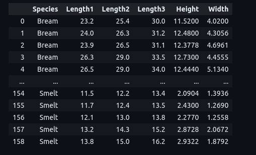

<h1> Fish Market Dataset Regression ML - Python Project</h1>
 
<h2>Features</h2>
<li>OpenML Dataset</li>
<li>Plot for each numerical feature</li>
<li>Splitting train set 80% & test set 20%</li>
<li>Correlations between features</li>
<li>Correlations as scatter plots</li>
<li>The most correlated features</li>
<li>One Hot Encoder</li>
<li>SimpleImputer for creating NumPy Array from DataFrame</li>

<h2>Acknowledgments</h2>

<b> Python3: http://bit.ly/python3-certifications <b>
 

<h2>Photo</h2>

 

<h2>Contact</h2>

<b> Email: mariusc0023@gmail.com </b>
